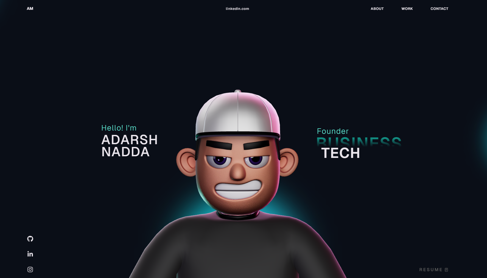

# Adarsh Portfolio

A modern interactive 3D portfolio built to showcase my projects, skills, and experience using immersive UI, smooth animations, and real-time 3D rendering.
This repository contains the source code for a personal 3D portfolio built with React, TypeScript, Three.js, React Three Fiber, and GSAP. It includes animated page sections, a character scene, custom cursor interactions, and smooth transitions designed for a modern portfolio experience.

🚀 Live Demo: https://adarsh-portfolio-jj1ckip1s-adarshauspicious-arts-projects.vercel.app/

---

## ✨ Features

- Interactive 3D character experience
- Smooth animations powered by GSAP
- Responsive and mobile-friendly design
- Custom cursor and hover effects
- Modular and reusable components

---

### Animation and 3D -

GSAP + @gsap/react - Three.js - @react-three/fiber - @react-three/drei - @react-three/postprocessing - @react-three/cannon - @react-three/rapier

### Supporting Libraries -

react-icons - react-fast-marquee - @vercel/analytics

## 🛠 Tech Stack

React • TypeScript • Vite • Three.js • React Three Fiber • GSAP • React Icons • Vercel Analytics

---

## Troubleshooting -

**Blank screen in development**
Check browser console for module import errors and verify all dependencies are installed. -
**3D performance issues on low-end devices**
Reduce scene complexity and post-processing effects in the character/scene utilities. -
**GSAP plugin errors**
Ensure you have the correct plugin package and license configuration for your target environment. -
**TypeScript build failures**
Run npm run build and address reported type errors before deploying.

## Project Structure

.
├── public/                    # Static assets
├── src/
│   ├── assets/                # Local media/assets
│   ├── components/
│   │   ├── Character/         # 3D scene + character logic/utilities
│   │   ├── styles/            # Section/component CSS files
│   │   ├── About.tsx
│   │   ├── Career.tsx
│   │   ├── Contact.tsx
│   │   ├── Landing.tsx
│   │   ├── MainContainer.tsx  # Main page composition
│   │   ├── Navbar.tsx
│   │   ├── TechStack.tsx
│   │   ├── WhatIDo.tsx
│   │   └── Work.tsx
│   ├── context/               # Global providers (loading state, etc.)
│   ├── data/                  # Static data/content definitions
│   ├── App.tsx
│   └── main.tsx
├── package.json
└── vite.config.ts
---

## ⚙️ Setup

git clone https://github.com/adarshauspicious-art/Adarsh-Portfolio.git  
cd Adarsh-Portfolio  
npm install  
npm run dev

---

## 📸 Preview

---

## 📬 Contact

Adarsh Nadda  
Email: adarshnadda2002@gmail.com || adarshauspicious@gmail.com
LinkedIn: https://linkedin.com/in/adarsh-nadda-a65328276

---

## 📌 Note

Built as part of my learning journey in modern web development, 3D web experiences, and animation-driven UI design.

